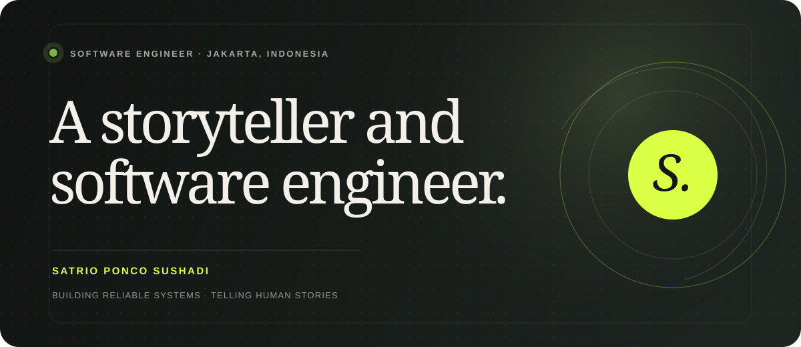
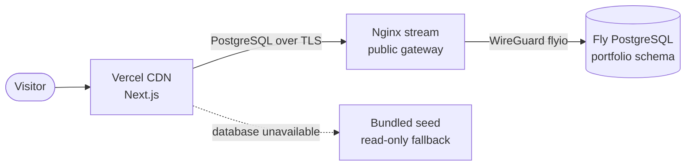

<p align="center">
  
</p>

<h1 align="center">Satrio Ponco Sushadi — Portfolio</h1>

<p align="center">
  A database-powered personal space for selected work, life in frames, and stories about learning.
</p>

<p align="center">
  <a href="https://github.com/poncosh"></a>
  <a href="mailto:satrioppp98@gmail.com"></a>
  
  
</p>

---

## The story

Portfolio ini adalah rumah digital untuk **Satrio Ponco Sushadi**, software engineer di BNI yang senang mengeksplorasi teknologi, menulis cerita dari proses belajar, dan bermain fun football. Tampilannya memakai pendekatan editorial: tipografi besar, komposisi foto yang ekspresif, serta ruang yang memberi setiap cerita kesempatan untuk bernapas.

Konten profil, sosial media, galeri, proyek, skill, pengalaman, dan journal dikelola melalui PostgreSQL. Saat database privat belum dapat dijangkau pada build, aplikasi memakai bundled seed yang identik agar preview tetap hidup.

## What lives here

| | Pengalaman |
| --- | --- |
| **Editorial hero** | Perkenalan personal dengan tipografi ekspresif dan foto utama. |
| **Life lately** | Lima foto dalam ribbon responsif yang dapat digeser di mobile. |
| **Selected work** | BNIdirect Bisnis, OASE BNI, skill SVG, dan pengalaman CI/CD. |
| **Field notes** | Journal dengan halaman artikel statis yang bersumber dari database. |
| **Light & dark** | Mengikuti tema sistem, dapat diganti manual, dan tersimpan di browser. |
| **Search-ready** | Canonical metadata, Open Graph, JSON-LD, image sitemap, dan robots policy. |
| **Resilient data** | PostgreSQL sebagai sumber utama dengan fallback read-only untuk build. |

## Built with

<p>
  
  
  
  
  
  
</p>

- **Frontend:** Next.js App Router, React Server Components, TypeScript, CSS.
- **Data:** PostgreSQL, Drizzle ORM, idempotent DDL dan DML.
- **Media:** `next/image` untuk seluruh foto raster, SVG untuk seluruh ikon skill.
- **Delivery:** Vercel di region Singapore, Nginx TCP gateway, dan database privat pada Fly.io.

## Architecture



Halaman utama memakai ISR selama satu jam. Pool production dibatasi satu koneksi per instance untuk menjaga database portfolio tetap ringan.

## Run it locally

Persyaratan: Node.js 24+, PostgreSQL, dan WireGuard aktif apabila memakai hostname Fly `.internal`.

```bash
npm install
cp .env.example .env
npm run db:setup
npm run dev
```

Untuk PowerShell, gunakan `Copy-Item .env.example .env` sebagai pengganti `cp`.

Buka [http://localhost:3000](http://localhost:3000). Jangan commit `.env` atau `flyio.conf`; keduanya sudah dikecualikan melalui `.gitignore`.

### Environment

| Variable | Required | Fungsi |
| --- | :---: | --- |
| `DATABASE_URL` | Production | PostgreSQL connection string yang disimpan sebagai secret. |
| `DATABASE_SSL` | No | Isi `true` untuk koneksi TLS end-to-end melalui gateway. |
| `DATABASE_POOL_MAX` | No | Maksimum koneksi pool per instance; default `15`. |
| `DATABASE_CONNECTION_TIMEOUT_MS` | No | Batas membuka koneksi; default `5000`. |
| `DATABASE_IDLE_TIMEOUT_MS` | No | Tutup koneksi idle setelah `30000` ms. |
| `DATABASE_STATEMENT_TIMEOUT_MS` | No | Batalkan statement setelah `15000` ms. |
| `DATABASE_MAX_LIFETIME_SECONDS` | No | Rotasi koneksi setelah `300` detik. |
| `NEXT_PUBLIC_SITE_URL` | Recommended | URL production untuk metadata dan Open Graph. |

`NEXT_PUBLIC_SITE_URL` juga menjadi sumber canonical URL, `sitemap.xml`, dan `robots.txt`. Di Vercel, aplikasi dapat memakai `VERCEL_PROJECT_PRODUCTION_URL` secara otomatis bila nilai tersebut tidak diatur manual.

## Database workflow

```bash
npm run db:migrate  # membuat schema dan tabel
npm run db:seed     # menyelaraskan seed dengan upsert
npm run db:setup    # menjalankan keduanya
```

| Resource | Lokasi |
| --- | --- |
| Drizzle schema | [`src/db/schema.ts`](src/db/schema.ts) |
| DDL migration | [`drizzle/0000_portfolio.sql`](drizzle/0000_portfolio.sql) |
| DML seed | [`drizzle/seed.sql`](drizzle/seed.sql) |
| Data access | [`src/data/portfolio.ts`](src/data/portfolio.ts) |

## Quality checks

```bash
npm run typecheck
npm run lint
npm run build
```

## Deploying

`portfolio-poncosh.internal` hanya tersedia melalui private network Fly 6PN. Vercel mengakses Nginx TCP gateway publik, sedangkan gateway menjalankan WireGuard dan meneruskan koneksi ke hostname internal. WireGuard tidak dijalankan di dalam Vercel Function.

Panduan deployment tersedia di **[Deployment Guide](docs/DEPLOYMENT.md)** dan template server siap salin berada di **[Gateway Guide](infra/gateway/README.md)**.

---

<p align="center">
  Designed and engineered with curiosity in Jakarta.<br />
  <strong>© 2026 Satrio Ponco Sushadi</strong>
</p>
